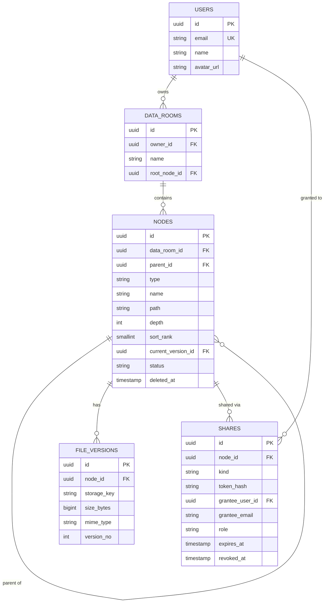

# Data Room

A virtual data room for M&A due diligence: organise documents in nested folders, upload PDFs, and share a room, folder, or single file with read-only access — either via a public link or with named recipients.

**Live app:** https://dataroom-takehome-web.vercel.app
**API:** https://dataroom-takehome-production.up.railway.app/health
> **Build status: in progress.** What is deployed today is the foundation — schema and
> migrations, Supabase JWT verification behind a global auth guard, and health
> endpoints. Uploads, sharing, the file viewer, search and the demo account are **not
> built yet**. Everything below describes the design being built toward; this note is
> removed, and the claim inverted, once the last block lands.

---

## Table of contents

- [Stack](#stack)
- [Running locally](#running-locally)
- [Architecture](#architecture)
- [Data model](#data-model)
- [Key design decisions](#key-design-decisions)
- [Edge cases handled](#edge-cases-handled)
- [Security notes](#security-notes)
- [How it scales](#how-it-scales)
- [Testing](#testing)
- [Where I used AI](#where-i-used-ai)
- [Known limitations](#known-limitations)

---

## Stack

| Layer | Choice | Why |
|---|---|---|
| Frontend | Next.js (App Router), TypeScript, Tailwind, shadcn/ui | Matches the team's stack; App Router gives route-level loading/error boundaries for free |
| Backend | NestJS, Prisma | Same |
| Database | PostgreSQL (Supabase) | Managed Postgres, same vendor as auth and storage |
| Auth | Supabase Auth (Google OAuth + email/password) | Removes ~2h of password-reset and OAuth plumbing that adds no signal to this exercise |
| File storage | Supabase Storage (private bucket) | Signed URLs, no public objects |
| Hosting | Frontend on Vercel, API on Railway | API runs as a long-lived Node process, not serverless — see [Architecture](#architecture) |

---

## Running locally

**Prerequisites:** Node 20+, pnpm, a Supabase project.

```bash
git clone <repo> && cd dataroom
pnpm install
```

### 1. Supabase setup

1. Create a project at supabase.com.
2. Create a **private** storage bucket named `dataroom-files`. Do not make it public — public objects cannot be revoked.
3. Under Authentication → Providers, enable Google and Email.
4. Under Authentication → Settings, disable "Confirm email" (or configure custom SMTP) so signup works without inbox round-trips.

### 2. Environment

`apps/api/.env`:

```env
# Pooled connection for the running app
DATABASE_URL="postgresql://...@...pooler.supabase.com:6543/postgres?pgbouncer=true&connection_limit=1"
# Direct connection — required for migrations
DIRECT_URL="postgresql://...@...supabase.com:5432/postgres"

SUPABASE_URL="https://xxx.supabase.co"
SUPABASE_SERVICE_ROLE_KEY="..."   # server only, never sent to the browser
SUPABASE_JWT_SECRET="..."         # or JWKS URL, depending on your project's key type
STORAGE_BUCKET="dataroom-files"
FRONTEND_ORIGIN="http://localhost:3000"
```

`apps/web/.env.local`:

```env
NEXT_PUBLIC_SUPABASE_URL="https://xxx.supabase.co"
NEXT_PUBLIC_SUPABASE_ANON_KEY="..."
NEXT_PUBLIC_API_URL="http://localhost:3001"
```

The service role key stays server-side. The browser only ever holds the anon key, and only uses it to sign in.

### 3. Database and seed

```bash
pnpm --filter api exec prisma migrate deploy
```

The seed script that creates the demo account and sample tree is not written yet.

### 4. Run

```bash
pnpm dev        # web on :3000, api on :3001
```

---

## Architecture

```
Browser ──── auth (login only) ────────────────► Supabase Auth
   │
   ├──── all data + authorisation ─────────────► NestJS API ──► Postgres
   │                                                  │
   └──── file bytes (via signed URL) ──────────► Supabase Storage
                                                      ▲
                                            signed URLs minted here
```

Three decisions worth explaining:

**Authorisation lives only in the API.** Row Level Security is enabled on every table with a deny-all policy, but purely as a backstop against accidental direct access with the anon key — not as the authorisation mechanism. Effective permission on a node is the maximum grant across its entire ancestor chain, which is awkward and slow to express as a recursive RLS policy, and would duplicate a rule that already exists in `resolvePermission()`. Two sources of truth for access control drift; one does not.

**File bytes never pass through the API.** Uploads and downloads go browser ↔ storage directly, using short-lived signed URLs minted by the API after a permission check. This keeps the API cheap and avoids request-size limits.

**The API is a long-lived process, not serverless.** Nest's module graph is built on boot — fine once, wasteful per-request. A cold start on every navigation is visible in the UI.

### Upload is two-phase

Naively "upload the blob, then insert the row" has two failure modes: an orphaned blob you keep paying for, or a database row pointing at nothing.

1. `POST /files/init` — creates the node with `status='uploading'`. **The unique index covers `uploading` rows**, so a name conflict raises `23505` here, before a single byte moves. Returns a signed upload URL.
2. Browser `PUT`s the file straight to storage.
3. `POST /files/:id/complete` — verifies the object exists, confirms the magic bytes, records size and checksum, flips `status='ready'`.

Listings only return `status='ready'`. Rows stuck in `uploading` for more than 15 minutes are swept by a scheduled job.

The trade-off in covering `uploading` rows is that an abandoned upload reserves its name for up to 15 minutes; a `23505` against an `uploading` row older than that is treated as abandoned — the row is soft-deleted and the insert retried once. Excluding those rows from the index instead would move the conflict to step 3, after the user has already transferred the bytes, and would let two concurrent uploads of the same name both pass step 1.

**PDF validation is server-side.** The browser checks for `%PDF-` before starting an upload so the user gets an immediate error, but the bytes go straight to storage and the API never sees them in flight — so the authoritative check is a `Range: bytes=0-7` read of the stored object during `/files/:id/complete`. A file that fails it never reaches `ready`.

---

## Data model



### Tree representation

Folders and files live in a single `nodes` table. `parent_id` is the source of truth; `path` is a denormalised materialised path (`/rootId/folderId/nodeId/`) maintained inside the same transaction as any structural change.

| Approach | Subtree query | Move | Complexity |
|---|---|---|---|
| Adjacency list only | Recursive CTE — one index scan per level, cost scales with depth | Single row update | Lowest |
| **Materialised path (chosen)** | One prefix range scan, depth-independent | Rewrite prefix for K descendants | Medium |
| Closure table | Index scan on `ancestor_id`, fastest both directions | Rebuild K × D rows | Highest |

Materialised path was picked because the expensive query in this app is "aggregate everything under this folder", and a prefix range scan answers it in one pass regardless of depth. A closure table would only pull ahead on ancestor-direction and depth-bounded queries, neither of which this app issues, and it introduces a second structure that must stay transactionally consistent through every insert, move, and delete. It can be added later as a pure derivative of `parent_id` without touching any existing column — so deferring it costs nothing.

`path` is stored as `text` with a `text_pattern_ops` index rather than `ltree`, because Prisma has no native `ltree` support and every subtree query would fall back to untyped raw SQL. Depth is capped at 32.

### Indexes

Partial and expression indexes cannot be expressed in `schema.prisma`, so these are hand-written in the migration files:

```sql
ALTER TABLE nodes ADD COLUMN sort_rank smallint NOT NULL
  GENERATED ALWAYS AS (CASE WHEN type = 'folder' THEN 0 ELSE 1 END) STORED;

CREATE UNIQUE INDEX nodes_name_uniq ON nodes (parent_id, lower(name))
  WHERE deleted_at IS NULL;

CREATE INDEX nodes_path_prefix ON nodes (path text_pattern_ops)
  WHERE deleted_at IS NULL;

CREATE INDEX nodes_listing ON nodes (parent_id, sort_rank, lower(name), id)
  WHERE deleted_at IS NULL;
```

`nodes_name_uniq` deliberately does not filter on `status`, so the constraint fires at `/files/init` rather than after the bytes have moved.

`nodes_listing` column order matches the listing `ORDER BY` exactly: `sort_rank, lower(name), id`. The generated `sort_rank` column exists because folders must sort before files but `'file' < 'folder'` alphabetically — and the obvious repair, `ORDER BY type DESC, lower(name) ASC`, mixes directions, which an all-ascending btree cannot serve as an ordered scan and which breaks tuple-comparison keyset:

```sql
WHERE (sort_rank, lower(name), id) > (:rank, :name, :id)
```

All ascending, one index scan, one comparison per page.

**Why every data room has a real root node** rather than `parent_id IS NULL`: Postgres treats NULLs in a unique index as distinct, so two files named `report.pdf` at the top level would both pass the constraint. A materialised root makes the constraint uniform at every level.

---

## Key design decisions

### Name conflicts

The brief requires conflicts to be resolved but does not specify how, so the strategy is chosen for the domain. In a due-diligence data room, a silent automatic action is actively harmful: `MSA.pdf` and `MSA (1).pdf` sitting side by side means a lawyer may open the wrong document and nobody finds out.

| Situation | Behaviour |
|---|---|
| Upload / move | Dialog: **Keep both** (default) / **Replace** / **Skip**, with "apply to all" for multi-file uploads |
| Rename | Blocked with an inline error and a suggested valid name |

**Replace creates a new row in `file_versions`** and repoints `current_version_id` — it never overwrites bytes. This is also what covers the optional versioning requirement.

Implementation notes:
- Conflicts are detected by catching Postgres `23505` from the unique index, not by a `SELECT` before `INSERT` — the latter is a time-of-check/time-of-use race under concurrent uploads.
- Names are normalised to Unicode NFC before comparison, so two byte-different spellings of `é` cannot coexist as visually identical siblings.
- Comparison is case-insensitive. Renaming only the case of a name excludes the node's own id from the conflict check.
- The rule applies to folders as well as files; they share one namespace per parent.

### Deletion

Soft delete (`deleted_at`), no user-facing trash.

- The brief calls out deleting a folder someone else is currently viewing. With a tombstone the API can answer `410 Gone`, and the viewer gets "This item was deleted by the owner" instead of an indistinguishable `404`.
- Blob deletion and metadata deletion are decoupled. A transaction spanning Postgres and object storage is not atomic; a background sweeper removes orphaned objects instead.
- Cascading a folder delete is one statement: `UPDATE nodes SET deleted_at = now() WHERE path LIKE :prefix || '%'`.
- Deleting a node does not touch its `shares` rows, and permission is resolved **before** the tombstone is checked. A recipient holding a valid share on a deleted subtree gets `410` and an explanation; a guessed token gets `404`. Checking `deleted_at` first is the natural way to write it and would turn `410` into an oracle for which node ids exist.

The cost is that every read must filter `deleted_at IS NULL`. All tree queries are funnelled through `NodesRepository` so the filter lives in one place — a Prisma client extension would not cover the `$queryRaw` calls where it matters most.

### Sharing

`shares` rows attach to any node — a data room root, a folder, or a single file. Effective permission is the **maximum grant across the ancestor chain**, so a link on a parent folder and a named grant on a child compose rather than shadow each other.

```
resolvePermission(user, node) -> 'owner' | 'editor' | 'viewer' | 'none'
```

One pure function, no I/O, exhaustively unit-tested. Every guard and every UI affordance derives from it.

### Public link vs named share

The brief requires that anyone holding a public link can view, so `/s/:token` is exempt from the auth guard.

Named shares deliberately reveal nothing to an unauthenticated visitor. The response depends on what we already know about the requester:

| Visitor | Response |
|---|---|
| Anonymous | "Sign in to view this item" — existence of the token is not confirmed |
| Signed in, email matches | Content |
| Signed in, email does not match | "This link isn't available for `<their own email>`" + switch-account action |

The mismatch message is built from the requester's own address, never the grantee's. Showing the intended recipient's email to whoever holds the token would leak who is on the deal — meaningful intelligence in an M&A context.

Shares granted to an email that has no account yet are stored as `grantee_email` and resolved to `grantee_user_id` on signup, so inviting someone who has not registered works without depending on email delivery.

---

## Edge cases handled

**Upload**
- Duplicate names within a folder (dialog, see above), including races between concurrent uploads
- Zero-byte files; oversized files rejected before upload starts
- Content sniffing — a `.pdf` that does not begin with `%PDF-` is rejected in the browser for immediate feedback and, authoritatively, by a `Range` read of the stored object before the node is marked `ready`
- Per-file cancel and retry; one failed file does not fail the batch
- Page refresh mid-upload leaves no orphaned rows (swept) or orphaned blobs (swept)

**Move / rename**
- Moving a folder into itself or into a descendant returns `400` (`path` prefix check)
- Name conflict in the destination folder
- Rename that changes only letter case
- Empty, whitespace-only, over-length names, and names containing path separators or control characters

**Delete**
- The confirmation dialog reports real counts and total size from `GET /nodes/:id/stats`, computed server-side over the whole subtree — not from whatever the client happens to have loaded
- Deleting a folder a share recipient is currently viewing → `410` and an explanatory screen with a route back, while an unauthorised requester still gets `404` for the same node
- Deleting a folder with an upload in flight

**Sharing**
- Revoking access while a recipient has the page open — the next request fails; the leak window equals the signed-URL TTL (60s), documented rather than hidden
- Expired links
- Read-only recipients get `403` on any mutation, enforced server-side, not merely by hidden buttons
- A file moved out of a shared folder loses inherited access but keeps any direct grant
- Rate limiting on `/s/:token` to make token guessing impractical

**Viewing / listing**
- Empty folders, deep nesting, very long names (breadcrumbs collapse with an overflow menu)
- Signed URL expiring while a PDF is open → transparently re-fetched
- Keyset pagination throughout; no `OFFSET`

---

## Security notes

- Storage bucket is private. Every object is reached through a signed URL with a 60-second TTL, minted only after a permission check.
- Share tokens are 256 bits of CSPRNG output. Only a SHA-256 hash is stored, so a database dump does not yield working links.
- `Referrer-Policy: no-referrer` on `/s/:token`, and full URLs are excluded from request logs, so tokens do not leak through the `Referer` header or log aggregation.
- Storage is served from a different origin than the app, so an uploaded file cannot execute in the app's origin.
- Nonexistent and forbidden resources both return `404` for unauthorised requesters — `403` would confirm that a resource exists. The same reasoning fixes the check order for deleted nodes: permission first, tombstone second, so `410` is only ever seen by someone who genuinely had access.
- `Content-Disposition: attachment` for anything that is not a PDF rendered inline, with RFC 5987 filename encoding.

---

## How it scales

### Total size and item count of a folder subtree

One prefix range scan, no recursion:

```sql
SELECT count(*) FILTER (WHERE n.type = 'file')   AS file_count,
       count(*) FILTER (WHERE n.type = 'folder') AS folder_count,
       coalesce(sum(v.size_bytes), 0)            AS total_bytes
FROM nodes n
LEFT JOIN file_versions v ON v.id = n.current_version_id
WHERE n.path LIKE :prefix || '%'
  AND n.deleted_at IS NULL
  AND n.status = 'ready';
```

This is exact and cheap at current scale. If subtree stats became hot enough to matter, the next step is a `folder_rollups` table maintained by triggers or an async worker, with the UI showing approximate figures. Deliberately not built — it trades correctness for speed to solve a problem this dataset does not have.

### One data room with 100,000 files

The tree is never loaded whole; only one folder's direct children are ever fetched.

- **Pagination:** keyset on `(sort_rank, lower(name), id)`, all ascending so a page is one tuple comparison. `OFFSET` degrades linearly and would sequential-scan deep pages.
- **Counts:** `LIMIT n+1` to derive "has more" rather than a full `COUNT(*)`.
- **Indexes:** as listed above; `nodes_listing` covers the listing sort exactly.
- **Rendering:** the file table is virtualised, so a 10,000-item folder renders a constant number of rows.
- **Search:** a GIN trigram index on `lower(name)`, because `LIKE '%term%'` cannot use a btree.
- **Storage:** unaffected — bytes never move through the API.

The first thing to break past this point is the soft-delete tombstone accumulation; the answer there is a purge job or partitioning by `data_room_id`.

### Extending sharing to per-user roles

`shares.role` already exists and already carries `'viewer' | 'editor'`. Adding editors means adding a case to `resolvePermission()` and the corresponding guards — no schema migration, no data backfill. Only `viewer` is exposed in the UI, because the brief specifies read-only recipients and shipping an unusable role toggle would violate "don't include unimplemented features".

---

## Testing

Tests are concentrated where a bug is a security incident rather than an inconvenience, not spread evenly for coverage.

- **`resolvePermission()`** — table-driven unit tests across owner, public link, named grant, revoked, expired, inherited-from-ancestor, and moved-out-of-scope cases. This function gates every read in the system.
- **Name conflict resolution and cycle detection** — unit tests, including the case-only rename and self-descendant move.
- **API security matrix** — e2e via Supertest: a non-owner gets `404`, a revoked token stops working, a viewer cannot mutate.
- **Happy path** — one Playwright run: sign in → create folder → upload → view → share.

Each of these is written in the same step as the code it covers, rather than in a
testing pass at the end. None exist yet — the code they cover does not either.

---

## Where I used AI

_TODO — replace with what actually happened. Be specific; "used Claude for boilerplate" reads as filler._

Template:

- **Scaffolding:** generated the initial Nest module/controller/service skeletons and shadcn component wiring.
- **Design review:** talked through the tree representation (adjacency list vs materialised path vs closure table) and the name-conflict and soft-delete strategies. The trade-off tables in this README came out of that discussion; the decisions are mine.
- **Edge case enumeration:** asked for failure modes I had not considered — the NULL-in-unique-index issue and the `Referer` token leak both came from that and were verified independently.
- **Not used for:** the permission resolution logic and the share token handling, which I wrote and tested by hand because a subtle error there is a data leak.

---

## Known limitations

_TODO — keep this honest and specific. It is more convincing than a longer feature list._

- Revocation is not instantaneous: an already-issued signed URL stays valid for up to 60 seconds. Eliminating this would mean streaming bytes through the API, which was not worth the latency.
- Subtree statistics are computed on demand. Fine at this scale, would need rollups past roughly a million nodes.
- Soft-deleted rows are never purged.
- Only `viewer` is implemented; `editor` exists in the schema but is not exposed.
- No audit log of who viewed what — a real data room would need one, and `shares` is the natural place to hang it.
- _TODO: anything you ran out of time for. Say what you would do, not that you would "add more tests"._
